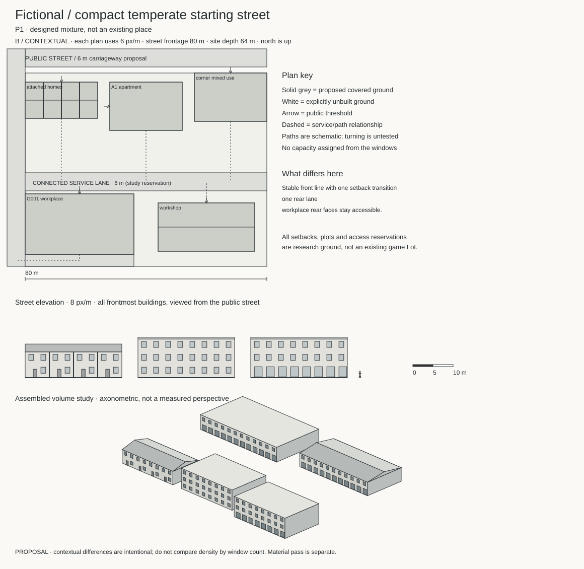

# A present-day city built from compatible families

Architectural research pass 03 · review edition 7 September 2026 · for city-sim's designer and model authors.

**Start with the fictional temperate street in this package. Choose complete building families and their ground relationships before choosing a regional slider.** Keep the five named contexts as comparisons, not interchangeable national styles. The recommendation is provisional: the drawings now make a preference review possible, but no player preference or game-content decision is implied.

The [illustrated review](index.html) is the entry point. Detailed evidence belongs in the [atlas](atlas/index.html), [source table](sources.csv) and [dimension table](dimensions.csv).

## 1. Which contexts are useful?

| Context | Useful contribution | Confidence / limitation |
|---|---|---|
| Sacramento postwar neighbourhoods and commercial corridors | Low detached forms, broad eaves, apartment forecourts and ordinary commercial frontage/service relationships | Medium: municipal survey and guidance; preservation selection is not stock prevalence ([CA1–4](atlas/index.html#CA1)) |
| South Bend incremental infill | Duplex/attached/small-apartment plans on individually legible plots | High for catalogue geometry; these are proposed designs, not a measured Midwest population ([US1](atlas/index.html#US1)) |
| Amersfoort planned extensions | Attached modules, mixed roof families, coherent front/rear ground | High for inspected programme; module width and GBO are not external width and gross floor ([NL1](atlas/index.html#NL1)) |
| Copenhagen postwar belt, especially Tingbjerg | Low apartment ranges, shared gardens, small infill and front/back differentiation | Medium: particular designed estate and separate construction typologies, not all Scandinavia ([DK1–3](atlas/index.html#DK1)) |
| València application of Mediterranean Spanish families | Compact apartment/shop relationships, party walls and roof-terrace construction alternatives | Provisional: construction examples are Mediterranean, not verified València addresses; block plans are proposed ([ES1–2](atlas/index.html#ES1)) |

Los Angeles dingbats remain an instructive sixth **counterexample**, not another fully developed street context. Their parking/circulation distinction cannot be made by recolouring a house ([LA1–2](atlas/index.html#LA1)). Berlin, Portland and earlier English evidence remain in previous passes; they do not need to be rediscovered to justify every design.

## 2. What should constitute the everyday stock?

Use detached and semi-detached houses, duplexes, attached ranges, small apartments, apartment ranges, corner mixed-use, block infill, standalone retail, small offices and workshops. The [coverage matrix](coverage-and-audit.md) explicitly shows weak cells. The current research is strongest on housing organisation, roofs and American commercial site guidance; it has not established measured European workplace families or empirical family frequencies.

The proposed street uses predominantly ordinary twentieth-century and recent buildings. Rare older survivors are the requested art direction, not a conclusion from an age census. The [history plate](drawings/retail-history.svg) separates a building's original form from later repairs and interventions.

## 3. Which physical differences matter?

[Comparison A](drawings/controlled-housing.svg) holds residential use, three floors, 9.6 m wall height and 1,152 m² gross study envelope constant. A1 is 24 × 16 m with corridor access; A2 is 32 × 12 m with two direct stair entrances. Both propose twelve architectural dwellings, with no simulation allocation. This is an access/footprint experiment, not proof that Americans use corridors and Danes do not.

[Contextual streets](index.html#contexts) let setbacks, party walls, plot organisation and rear access differ. These changes cannot fit inside a material slider. All six streets use original proposed ground; their dimensioned paths are reservations, not verified fire/vehicle access.

[The workplace plate](drawings/workplace.svg) keeps G001's full two-floor body and introduces a floor-support grid, cores, receiving space and roof drainage. A single-storey hall or partial mezzanine would not preserve its counted floor.

## 4. What is regional, and what has another cause?

Treat region as a bundle of historically related choices, not their sole cause. Structure responds to span/use/economics; frontage responds to plots and regulation; shading and envelope construction respond to climate; repair responds to the existing assembly. The same context contains multiple eras and roof types. [Construction rules](construction-rules.md) identify the dependencies and the evidence behind them.

An 11° membrane roof and a steep tiled roof are different assemblies. A parapet is an edge, not evidence that the deck is level. The inspected retrofit sheets show actual drains, curbs and junctions ([CA5](atlas/index.html#CA5)); the manufacturer sources even disagree across editions about generic drainage prescriptions ([C2–3](atlas/index.html#C2)).

## 5–6. What can mix, and what could a slider control?

Within a building, vary finish, repaired panels, canopies and compatible openings around a stable structure/access plan. Along a street, mix complete families with compatible thresholds, party edges and connected service ground. Between neighbourhoods, permit larger layout changes. The fictional study combines attached homes, a corridor apartment, corner commerce and working rear buildings; it does not morph one national silhouette into another.

**Defer the slider UI.** If retained, it should weight eligible whole designs within a chosen layout/climate package. It must not continuously interpolate stair topology, courtyards, roofs, storeys or capacities. Named context presets are a clearer initial review control. Current evidence cannot supply their weights; the prior endpoint demo tested selection only. See the [mixing rules](mixing-rules.md).

## 7. How does history accumulate?

Propose one selectively retained older corner in a later prototype, modest postwar houses, later apartments and repaired workplaces. Keep original date, intervention date and condition independent. New glazing, insulation returns, external shading, PV and roof equipment need credible junctions and maintenance space. A balcony extension can consume new ground or add area; it is not automatically an appearance-only change. Nottingham and Grand Parc demonstrate mechanisms, not a required citywide treatment ([RFT1–2](atlas/index.html#RFT1)).

## 8–9. What fits the simulation, and what comes next?

The [audit](simulation-audit.md) freshly reconstructs the archived 52-component sample, not a new simulation run. G003 is a plausible apartment-scale envelope, but its reconstructed two-tenancy ceiling does not authorize twelve represented homes. G001 is a stronger first exact-body workplace experiment. Existing simulation courtyard support must be read through `BuildingPlan`; it does not authorize carving a court into any solid body.

Build the [five-body research street](model-briefs.md): attached residential range, A1 apartment, corner mixed-use, G001 workplace and workshop. Keep an A2 alternative beside it on separately authored ground. Review entrances, backs and roofs in monochrome before materials. These briefs and drawings are completed research proposals; production modelling, engineering checks, game integration and player preference testing remain unperformed.
